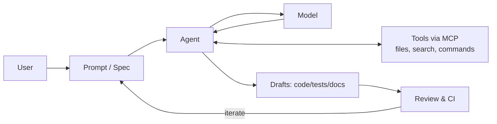

## Vibe Coding

### 1. Essence: Origins, Philosophy, Core Ideas

#### Origin & definition

The phrase *vibe coding* was coined by Andrej Karpathy in February 2025 to describe a style of building where you "fully give in to the vibes… and forget that the code even exists."

Within weeks, Merriam-Webster added an entry describing vibe coding as telling an AI what you want and letting it create the product.

#### Philosophy

- **Natural language first**: You describe the *what*; agents draft the *how*. GitHub Copilot and Copilot Chat support explanation, test generation, and fixes directly in IDEs and on GitHub.

- **Iteration over rigid planning**: Agents propose, you review, and iterate—often faster than manual cycles.

- **Democratization with trade-offs**: Accessibility rises, but you must manage maintainability, security, and accountability.

- **Beyond "just coding"**: The same loop drafts docs, explains code, and sets up experiments.

#### Core ideas

- **Prompt-Driven Development (PDD)**: Prompts (and prompt packs) become versioned, reusable artifacts that drive consistent outcomes. (Tooling support: saved rules/presets in Cursor; promptable chats in Copilot.)
- **AI as collaborator (agentic)**: Humans set direction, agents perform scoped tasks, and submit changes as pull requests for review.
- **Beyond coding tasks**: Agents help with documentation, learning, research, and repo-level chores.

### 2. Tooling Landscape & Internals

#### Categories

| Category       | Tools & Platforms                              | Notes                             |
|----------------|--------------------------------------------------|-----------------------------------|
| IDE-Based      | Cursor AI; Visual Studio Code + GitHub Copilot  | Traditional IDEs with AI support  |
| Terminal-Based | Gemini CLI; Claude Code; OpenAICodexCLI         | Command-line AI coding assistants |
| Web-Based      | lovable; bolt.new; Replit; GitHub Codespaces    | Browser-based coding platforms    |
| Early          | OpenAI Codex                                    | Early LLM coding interface        |

> **Reference Note — IDE / Cloud IDE**: An *IDE* is where you edit/run code. A *cloud IDE* (e.g., Codespaces) runs the environment online so everyone shares the same toolchain and dependencies.

#### How these tools work internally

- **MCP (Model Context Protocol)** is an open standard for secure two-way connections between AI apps and tools/data—"USB-C for AI."
- **Gemini CLI** explicitly documents a ReAct loop and MCP server integrations for acting on your repo and environment.
- **Copilot coding agent** can work a task/issue, run in a sandbox with Actions, and submit a PR for your review.

#### Not just for coding

- **Explaining code, generating docs/tests**: Copilot Chat in IDE or on GitHub
- **Browser-based "idea → app"**: Replit Agent creates and iterates on apps from natural language.

### 3. Methodologies that Work (PDD vs SDD + Hybrids)

#### Prompt-Driven Development (PDD)

- **Concept**: Prompts (and "prompt packs") are versioned and reused like code; you iterate quickly in small loops. Cursor supports persistent rules/contexts; Copilot supports saved chats and repo context.
- **Strengths**: Fast prototyping; good for solo/small teams.
- **Workflow**: Prompt → draft → test → improve → version. (Agents can turn changes into PRs for traceability.)

#### Spec-Driven Development (SDD)

- **Concept**: Begin with a living specification (requirements, tech stack, constraints, test strategy). Feed the spec to agents to generate code/tests; evolve spec and code in lockstep.
- **Strengths**: Suits larger/regulated projects; aligns with governance/testing from day one.
- **Workflow**: Spec → plan → tasks → implementation, enforced by CI and PR gates

> **Practical reality**: Most teams run hybrids—a concise spec (SDD-lite) plus reusable prompt packs (PDD) to iterate features while preserving control.

#### Getting started — three entry points

1. **From scratch** (greenfield): let an agent scaffold the app; add tests early. (Replit Agent quickstarts; Copilot/IDE tutorials.)
2. **From sample code**: import a template; iterate with Cursor/Copilot in tight loops.
3. **From open-source**: assign a task to Copilot's coding agent; review the PR; enforce CI checks.

#### First-prompt strategies

- **Perfection-oriented (SDD-ish)**: Specify stack, architecture, and acceptance tests in the first prompt for stability.
- **Incremental (PDD-ish)**: Start broad, then harden prompts based on results—still include debugging and testing instructions for repeatability.

#### Who writes the prompts?

- **Human-driven**: Maximum precision and control (good for safety-critical tasks).
- **AI-driven**: You describe outcomes; the agent drafts the detailed prompts (works best when your spec/constraints are already in context).
- **Hybrid**: Humans set direction; agents propose/refine prompts and code under CI/PR gates.

#### Improving features: two effective pathways

- **Human-guided debugging & enhancement**: You inspect code/tests and direct exact fixes; the agent makes scoped changes and PRs
- **AI-driven debugging & enhancement**: You provide symptoms; the agent hypothesizes causes, edits files, and proposes a PR. (Gemini CLI's ReAct + MCP servers are built for this loop.)

#### Enhance vs. prompt-driven restart

- **Enhance in place** when state/history matter and diffs must be auditable.
- **Prompt-driven restart** when tangles exceed patch value—cheap with agents, but version prompts/specs so results are reproducible.

### 4. Safety, Governance, and Data Handling

#### Security risks

Use the OWASP Top-10 for LLM Applications to design mitigations (e.g., Prompt Injection, Insecure Output Handling, Supply-Chain Vulnerabilities, Excessive Agency). Build checklists for reviews and CI policy gates.

#### AI governance frameworks

- **NIST AI RMF (GenAI Profile)**: trustworthy-AI characteristics and concrete actions to manage GenAI risks across the lifecycle
- **ISO/IEC 42001 (AI management systems)**: organization-level management system for responsible AI (requirements + guidance)

#### Enterprise controls (GitHub Copilot)

- **Org/Enterprise policies**: enable/disable features; define model access; enforce policies across orgs.
- **MCP server access**: enterprise policy to enable MCP and (preview) registry/allowlist controls in VS Code Insiders; pair with network allowlists.

> **Reference Note — OWASP LLM Top-10**: A community standard cataloging Gen-AI risks with concrete mitigations. Use it to shape prompts, tools, and CI checks.

### 5. End-to-End Flow with CI/CD

A practical vibe-coding pipeline couples agent PRs with CI/CD so nothing merges without checks.

1. **Agent proposes a change**: Copilot coding agent → PR
2. **CI/CD runs**: build, unit/integration tests, static analysis, policy checks.
   - GitLab CI/CD and AWS CodePipeline offer official, prescriptive guidance.
3. **Human review** gates the merge; production deploy follows CD rules (manual approval for delivery vs. automatic for deployment)
4. **Codespaces** standardizes environments so agent runs/tests are reproducible across contributors.